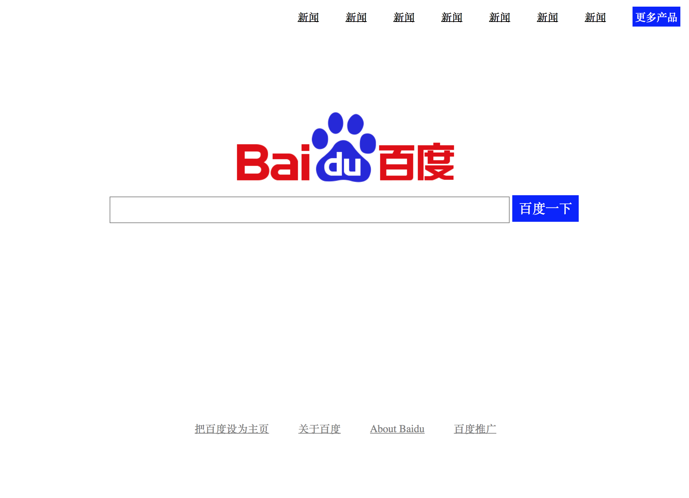

# 2018 Web研发部前端第一次作业

使用HTML和CSS做一个页面，实现如下图的效果：

### 要点

- 中间有一个input框
- 只需要有样子，不需要有什么功能（只要长得像这样就可以
- 使用外联CSS

*看起来很难？这儿有提示：*

### 提示

- 主要用到了float、margin
- 你们可能注意到了中间的搜索框和百度logo是居中的，这个东西可以通过活用margin来实现
- input框本来是有默认的样式，但是那个太丑了啊，有一个css属性可以去除默认样式，你知道是什么吗？

## 预习部分

下面的知识基本都是下节课要讲的，请做好预习，以后的车不会开慢：

- **CSS盒模型**，布局重点，这个是下节课肯定要讲的
- position属性的各个值的区别
- CSS选择器，上课讲的知识点一定要弄会

### 进阶

如果以上都会了，有能力的话开始学习JavaScript吧，先像我在课上讲的那样，写个helloWorld。

作业请在周五24:00之前交至 zhangdeming@redrock.team

有问题先百度，还是找不到就在群里问，实在弄不懂了可以问学长学姐。

加油～
