我们从这个页面开始建立一个java项目：

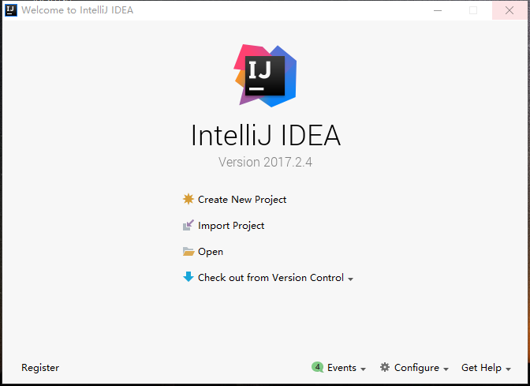

点击Create New Project，然后看到如下页面

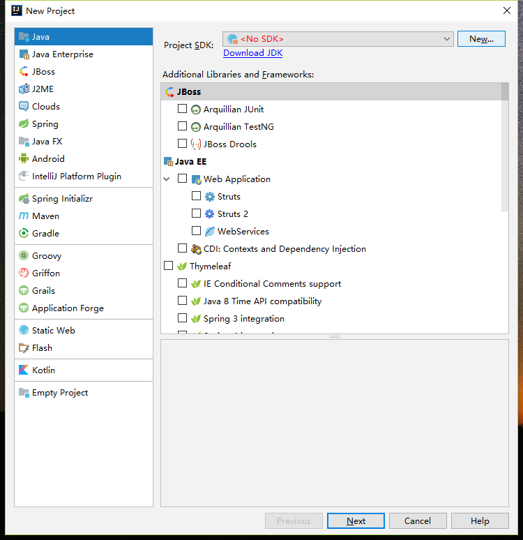

右侧栏最上面红字写着No SDK，说明我们没有设置jdk路径，假如你还没有安装jdk，那么请先安装jdk，并配置好环境变量，具体过程参照群文件的java环境配置。

安装jdk成功后，点击No SDK 右边的new按钮，弹出以下窗口：

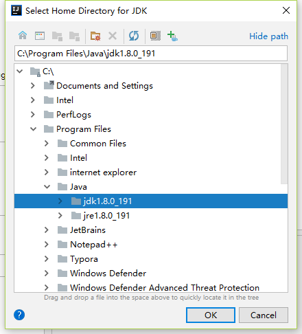

在这里找到你的jdk路径，然后选中你的jdk文件夹，我的jdk文件夹名是jdk1.8.0_191,文件夹名不一样的不要紧，你选中了就行（像上图那样出现蓝色横杠），然后点击ok。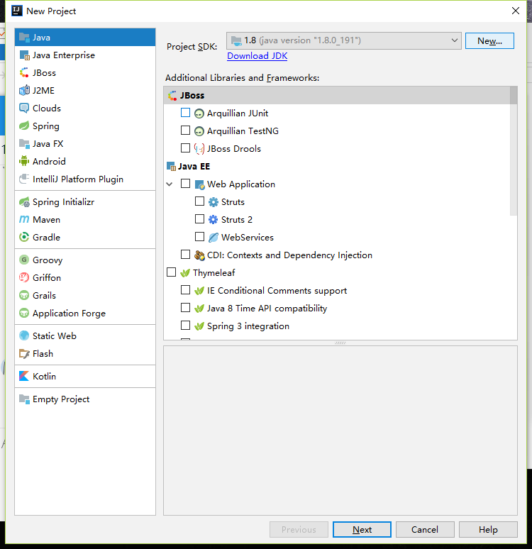

如上图所示，已经不报红了。

参照上图：左侧栏选中Java，右侧栏啥都不用选，点击next，出现了如下页面。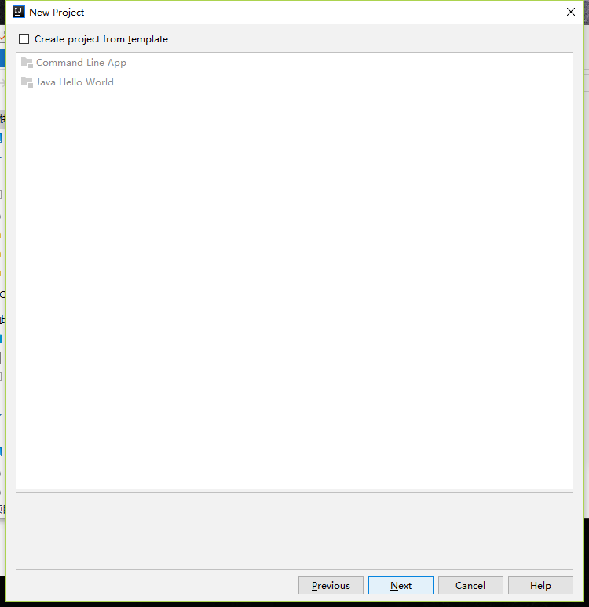

这个页面不要动，直接再点next。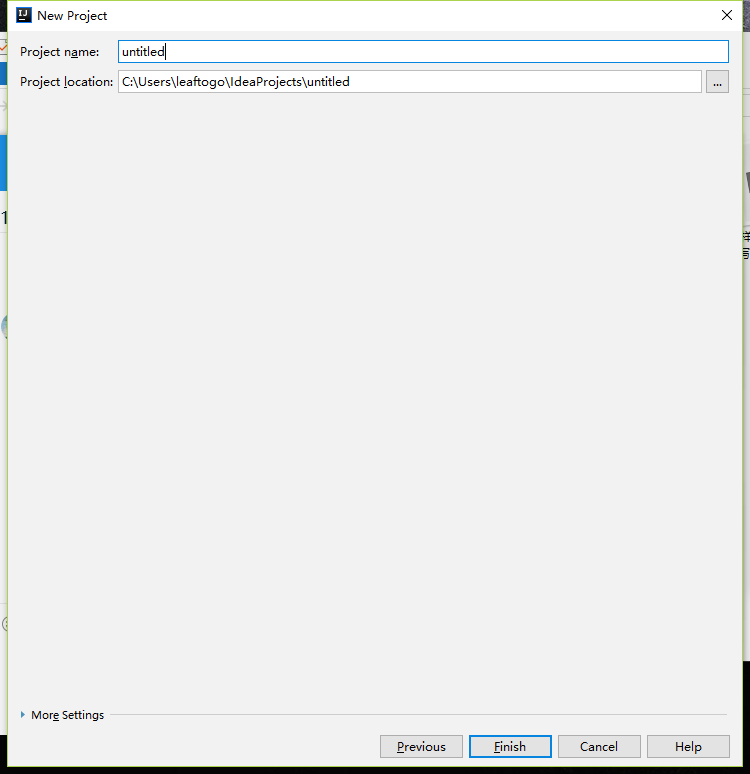

如上图所示，Project name是你们的项目名字，不要是中文，必须由英文，下划线，数字组成。（避免一些玄学问题，写中文的出了问题自行解决哦） 除此以外想写什么写什么，你甚至可以在这里向学长学姐们表白。

Project location是你们的项目文件所在路径，自己设置吧。注意，这里强制要求由英文，下划线，数字组成，即你的每一级文件夹命名都是由英文，下划线，数字组成。路径绝对不能包含中文。

写完之后点击下面的finish。然后等待idea为你创建项目。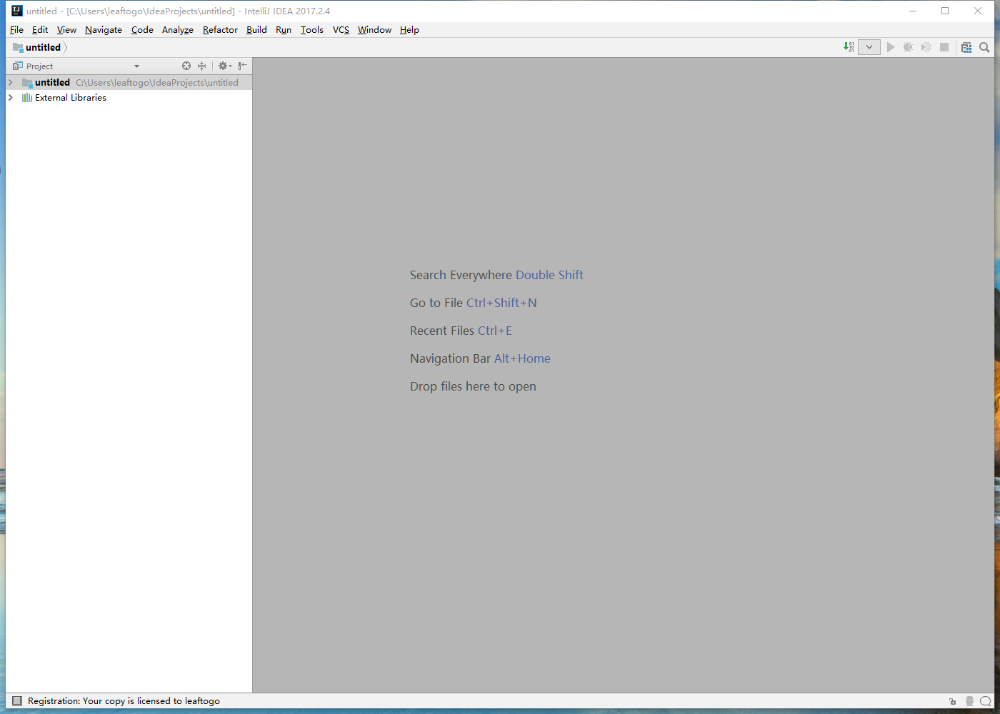

如上是idea建好了项目的界面。在左上有两个侧栏，如下图：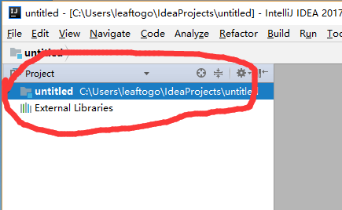

其中第一行的untitled是我们的项目文件夹，untitled就是我之前给项目的命名，下面那个不用管，别动它。

双击展开untitled 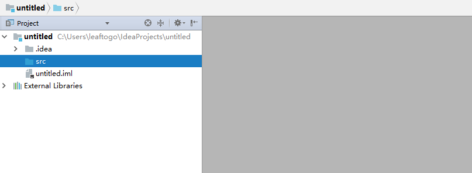

可以看到三个文件(夹)，其中.idea和untitled.iml是idea的配置以及日志文件，不要动它们。注意，你们交作业的时候也不要把这两个文件打包上传了（1.他们可能会比较大 2.这里面记录了你的idea操作信息，涉及到你的一些隐私，所以不要传。），交作业只交这里的src文件夹就好了。怎样找到这个src文件夹在哪里？注意看最上面项目名称旁边有一行灰字，是你的项目路径，在这里去找。

现在我们开始写第一行java代码了，我们需要先建一个java文件，右键上图的src文件夹，出现以下内容：

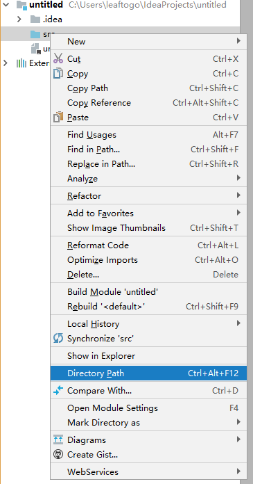

鼠标移动到new上面：

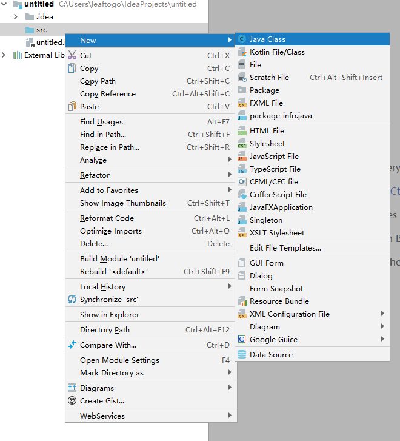

点击最上面的Java class，然后弹一个小页面，输入你的java类名（类名不能是Main或者main，会和主函数的main有冲突），点ok。

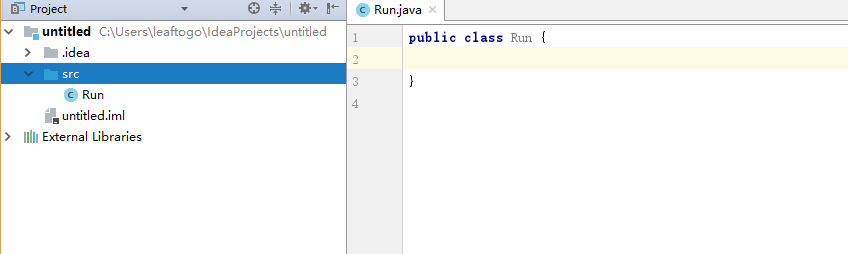

类名我取为Run，现在我们开始写一个main函数然后开始运行试试吧。

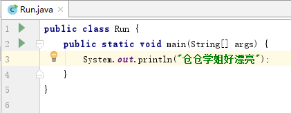

运行方法：

你可以直接点击你想运行的main函数左边的绿色小三角

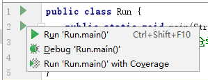

然后点击第一行的Run 'Run.main()'

接下来idea会先编译你的代码，然后再运行。

我们可以看到控制台打印了相应的结果：

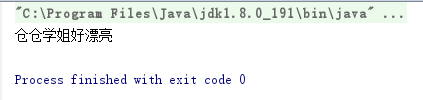

idea会记录下你运行了那些函数，然后将它们记录下来，你可以看到，在下图中，右上角出现了一个绿色小三角（假如你什么也没有运行过，这个小三角将是灰色的），这个绿色小三角的作用是，运行项目，点击绿色小三角，idea将会运行Run类的主函数。

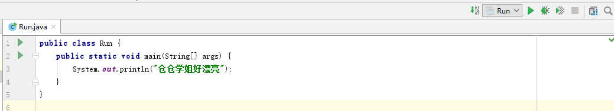

同时，小三角左侧的Run是我需要运行的主函数所在类名。假如你有多个运行了的主函数，并且你想切换点击小三角之后idea运行的类的主函数，你可以在上图绿色小三角左侧这里的向下黑色箭头，点击它然后进行修改。

## 一些问题：

#### A：怎么写多个java类：

假如你需要写多个java类，那么你可以向上面一样再建立一些java文件，然后写代码。

一个java文件里面只能有一个公有类，即public class，且公有类的类名必须和这个java文件的文件名一样。但是普通类的数量不限，即没有关键字public修饰的class，且普通类的命名可以和其所在java文件的文件名不一样。

#### B：怎么建立文件夹：

为了分类，你可能会想建立文件夹。你可以

1.桌面，打开此电脑，不停双击左键进入文件夹找到你的项目文件夹，在对应地方建好文件夹然后移动源码文件到对应位置。idea会自动读取项目文件夹下的源码文件，然后你可以在idea窗口左侧查看文件结构。

2.在idea窗口内左侧，右键src→new→package，输入文件夹名，ok。idea将会在src目录下建立一个你命名的文件夹。

#### C：怎么在src目录的某个子目录处建立文件夹或者java文件：

假设这个子目录名为Tool，你可以在idea窗口内左侧，右键Tool这个文件夹→new，然后选择你想创建的东西。

