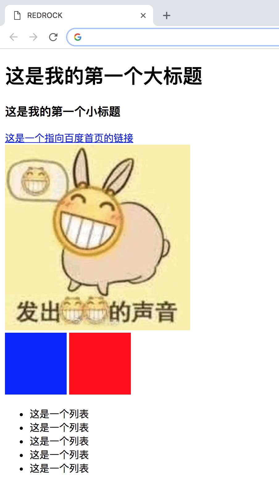

# 2018 红岩网校工作站 Web前端预习作业

- 写一个html文档，完成如图所示的效果（图片自己找一张就可以

  

### 基本要求

- 完成图示的样子，大家加油哦
- 提示
  - 你可能会发现你写的汉字在浏览器中是乱码的，有一个标签可以解决这个问题
  - 最底下的几个方块的标签都是div（不是img），他们的颜色是通过一个css属性实现的，同时他们之间也有一些间隔，也是一些css属性
  - 你可以使用标签的style属性来写内联css

### 进阶（尝试下，不会也没关系

- a标签默认是点击后本页面直接刷新，不保留原窗口的，但某人想点击后跳转出一个新窗口（即让两个页面都存在），怎么办？（提示：a标签有一个属性可以办到）
- css可以直接写在html文件中，但我们是不推荐这样的。请尝试用外联css（即css和html在两个文件中）
- 你有没有方法，让上面的那张图片点击的时候跳转到百度首页？（提示：a标签和img标签配合使用）

### 一些学习资料

- http://www.w3school.com.cn/html/index.asp 这个网站上可以从最基础来学习html
- www.imooc.com 这里面有很多视频
- 还有一个叫 [MDN](https://developer.mozilla.org/zh-CN/)，这个里面的知识点会比较新，当然也会难一点

### 交作业

下周五晚（10月26日） 24:00 之前请交到 zhangdeming@redrock.team 这个邮箱。**请记住写上你的年级、姓名**。

### 最后

​	你们经过了笔试面试，最后加入了这个群，是很厉害了。但这仅仅意味着开始。我们都希望你们能坚持一年，然后成长为未来的大佬。网校历届学长学姐都是前辈们带出来的，我们刚进来的时候也和你们一样，所以：

- 零基础不要担心，只要你们坚持，一定可以的！
- 如果你是一个有基础的大佬，那也请不要掉以轻心，知识是无穷尽的，一定要坚持学习。

千里之行，始于足下。加油！

